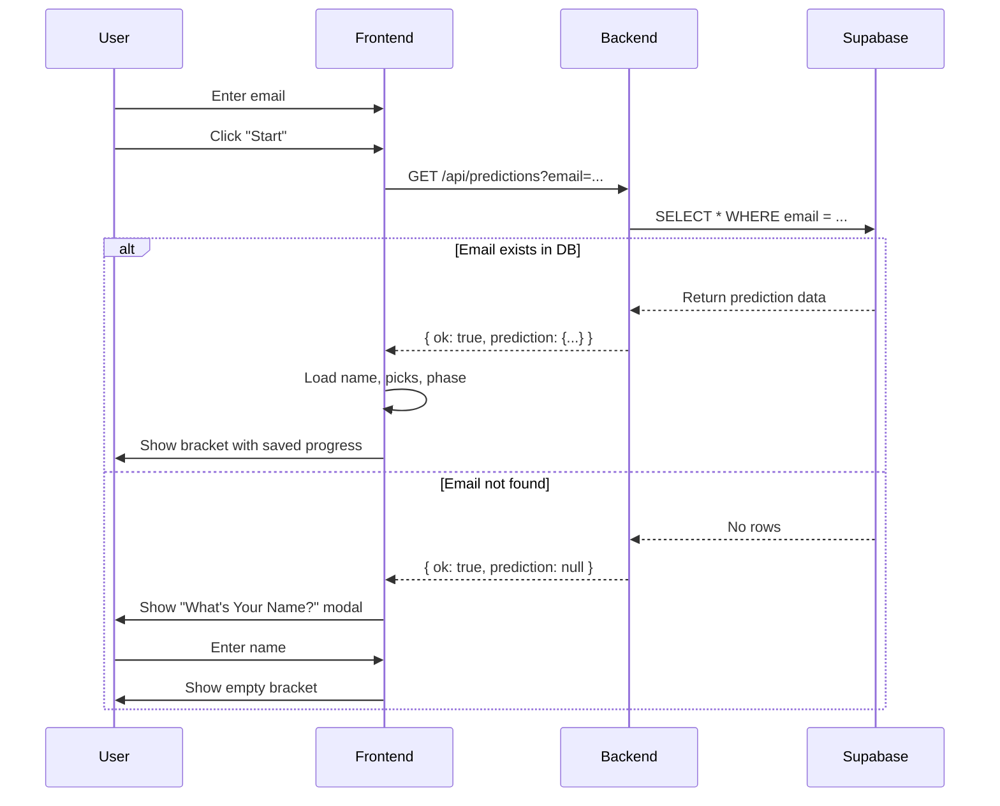

# 🌐 Cross-Device Sync Feature

## How It Works

When you login with an email on **any device/browser**, the system:

1. **Checks the database** for existing predictions with that email
2. **If found**: Loads your saved name, picks, and progress
3. **If not found**: Asks for your name (new user)

---

## Use Cases

### Scenario 1: New User

```
Device A (Chrome):
1. Enter: john@example.com
2. System: "No existing data found"
3. Modal: "What's Your Name?"
4. Enter: John Doe
5. Start making picks
6. Auto-syncs to cloud ✅
```

### Scenario 2: Existing User, Different Device

```
Device B (Safari/Phone):
1. Enter: john@example.com
2. System: "✅ Found existing data!"
3. Loads: Name = "John Doe", Picks = {...}
4. Continues where you left off!
5. Auto-syncs updates ✅
```

### Scenario 3: Same Device, Different Browser

```
Device A (Firefox):
1. Enter: john@example.com
2. System: "✅ Found existing data!"
3. Loads your bracket instantly
4. Make more picks
5. Auto-syncs ✅
```

---

## Technical Flow



---

## API Changes

### New Endpoint: GET /api/predictions?email=xxx

**Request:**

```bash
GET /api/predictions?email=john@example.com
```

**Response (Found):**

```json
{
  "ok": true,
  "prediction": {
    "id": "...",
    "email": "john@example.com",
    "name": "John Doe",
    "picks": {...},
    "phase": "predict",
    "champion": null,
    "picks_count": 15,
    "created_at": "...",
    "updated_at": "..."
  }
}
```

**Response (Not Found):**

```json
{
  "ok": true,
  "prediction": null
}
```

---

## Security & Privacy

### Email Uniqueness

- One email = One prediction
- Email stored as lowercase
- Case-insensitive lookup
- Unique index in database

### No Authentication Required

- Public read by email (for convenience)
- Admin dashboard requires password
- Email acts as natural identifier

### Data Ownership

- Email "owns" the prediction
- Anyone with the email can access/update
- Use strong, private emails for security

---

## User Experience

### Loading States

```
1. User enters email
2. Clicks "Start →"
3. Button shows: "Checking..."
4. System queries database
5. Either:
   - Loads saved data (instant)
   - Shows name modal (new user)
```

### Console Messages

```javascript
// New user
"📝 No existing data, showing name modal";

// Existing user
"✅ Found existing prediction for email: {...}";
```

### Visual Feedback

- Button: "Checking..." during lookup
- Smooth transition to bracket
- No jarring reloads

---

## Testing

### Test 1: New User

1. Clear localStorage
2. Enter fresh email: `test1@example.com`
3. Should see name modal
4. Enter name
5. Make some picks
6. Check admin dashboard - should see entry

### Test 2: Same Email, Different Browser

1. Open incognito/private window
2. Enter same email: `test1@example.com`
3. Should **NOT** see name modal
4. Should load directly to bracket with saved picks!

### Test 3: Different Email

1. Enter different email: `test2@example.com`
2. Should see name modal (new user)
3. Independent prediction from test1

---

## Benefits

✅ **Seamless**: Login from any device
✅ **No passwords**: Email-based access
✅ **Auto-sync**: Always up-to-date
✅ **Simple**: One field login
✅ **Persistent**: Never lose progress
✅ **Cross-platform**: Desktop, mobile, tablet

---

## Limitations

⚠️ **Email sharing**: Anyone with the email can access
⚠️ **No password**: Convenience over security
⚠️ **One bracket per email**: Can't have multiple predictions

---

## Future Enhancements

💡 **Possible improvements:**

- Add password protection (optional)
- Allow multiple brackets per email
- Email verification (magic link)
- Social login (Google, Facebook)
- Offline mode with sync

---

## Database Schema

```sql
CREATE TABLE public.predictions (
  id uuid PRIMARY KEY,
  client_id text UNIQUE,
  name text NOT NULL,
  email text NOT NULL,          -- ⭐ Used for cross-device lookup
  picks jsonb,
  phase text,
  champion text,
  picks_count integer,
  created_at timestamptz,
  updated_at timestamptz
);

-- Unique email index
CREATE UNIQUE INDEX predictions_email_idx
  ON public.predictions (lower(email));  -- ⭐ Case-insensitive
```

---

## Success! 🎉

You can now:

- Start on desktop
- Continue on phone
- Check on tablet
- All with just your email!

**Your predictions follow you everywhere.** ✨
